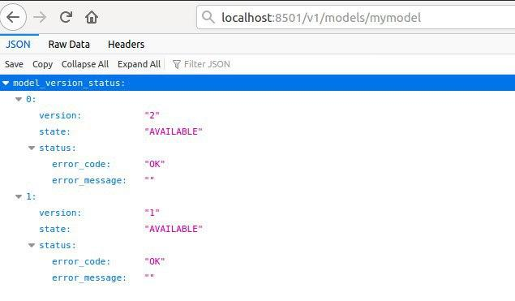

# tfserving_tutorial
tensorflow serving tutorial

## how to start (beginner guide):

### what is docker and how to install

todo

### prerequirements:

1) Download the TensorFlow Serving Docker image

```
docker pull tensorflow/serving
```
2) Download the repo

```
git clone https://github.com/tensorflow/serving
```

### export trained model:

In new version you should only pass **save_format="tf"** parameter to **save** method:
```
model.save('saved_model/1/', save_format="tf")
```

Now, You can easily load it with **load_model** :

```
new_model = tf.keras.models.load_model('saved_model/1/')
```

* We can save several versions of a model, such as different hyperparameter, so if you want to train a new model, you can simply change a version number

```
# Export the model to a SavedModel
model2.save('saved_model/2/', save_format="tf")

# Recreate the exact same model
new_model2 = tf.keras.models.load_model('saved_model/2/')

```

* We are not using an old fashioned syntax anymore:
```
# Export the model to a SavedModel (deprecated syntax)
keras.experimental.export_saved_model(model, )

# Recreate the exact same model (deprecated syntax)
# new_model = keras.experimental.load_from_saved_model('saved_model/1/')

```

### Full code in jupyter notebook:

[ModelDeployment.ipynb](./ModelDeployment.ipynb)

### Config file

Create a **models.config**  file with this content

```
model_config_list {
  config {
    name: 'mymodel',
    base_path: '/models/mymodel',
    model_platform: 'tensorflow',
    model_version_policy: {
    	all: {}
    }
  }

}
```

why?! todo

###  Start TensorFlow Serving container and open the REST API port

Type a folowing command in terminal:

```
docker run -it -d -p 8500:8500 -p 8501:8501 --name tfs_mymodel -v $(pwd)/saved_model:/models/mymodel:rw -v $(pwd)/models.config:/models/models.config:rw -e MODEL_NAME=mymodel tensorflow/serving --model_config_file=/models/models.config
```

#### parameters description
todo

### Check API:
type
```
localhost:8501/v1/models/mymodel
```
in your browser, you should see the folowing output:




### Call inference API

If you  want send a request and get the prediction from latest version, you can simply try:

```
import json
import numpy
import requests
data = json.dumps({"signature_name": "serving_default",
                   "instances": x_test.tolist()})
headers = {"content-type": "application/json"}
json_response = requests.post('http://localhost:8501/v1/models/mymodel:predict',
                              data=data, headers=headers)
new_predictions = numpy.array(json.loads(json_response.text)["predictions"])
```


But if you want give your response from a specific version, like version 1 (It is shown in an image in previous section), you should specify a version in a post url with changing a **mymodel:predict** to **mymodel/versions/[your_model_version]:predict**
So, our final code for get inference from older version:

```
import json
import numpy
import requests
data = json.dumps({"signature_name": "serving_default",
                   "instances": x_test.tolist()})
headers = {"content-type": "application/json"}
json_response = requests.post('http://localhost:8501/v1/models/mymodel/versions/1:predict',
                              data=data, headers=headers)
new_predictions = numpy.array(json.loads(json_response.text)["predictions"])
```

you can try it with a notebook:

[inference-api.ipynb](./inference-api.ipynb)
